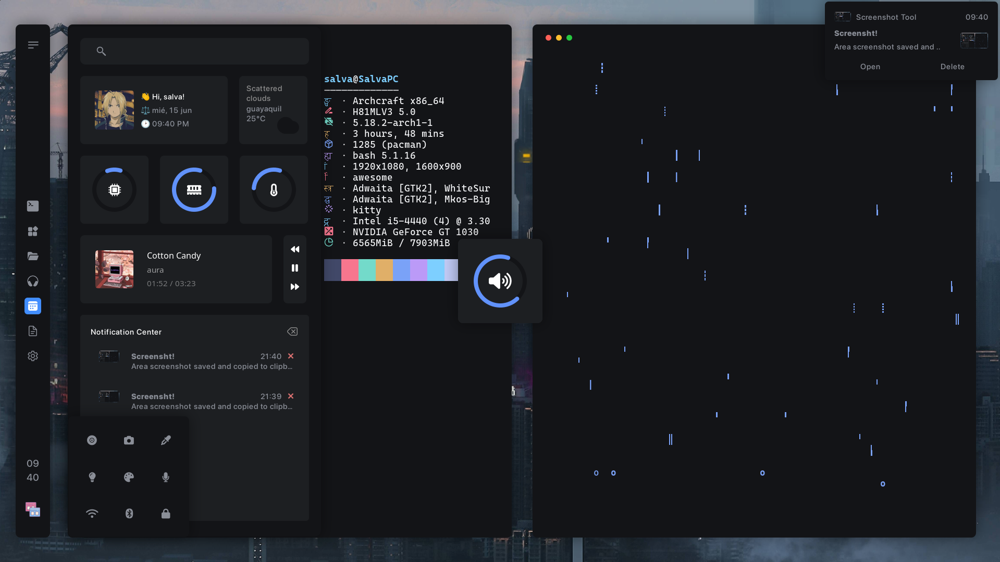
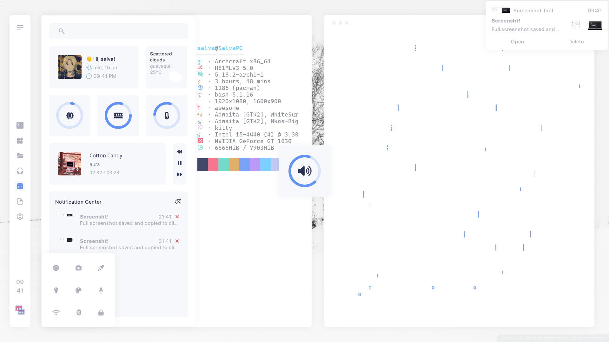
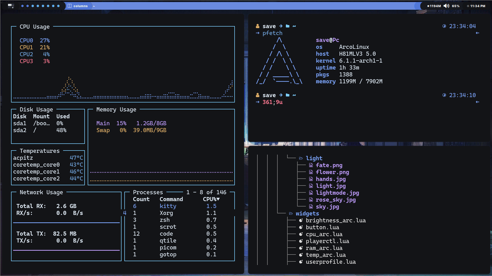

<h2 align="center" style="font-weight: bold">My dotfiles for rice AwesomeWM</h2>

## __Hi!__

to my dotfiles!
Here are some details about my setup

### AwesomeWM

<!-- Dark theme -->
<div align="center">
   <a href="#--------">
      
   </a>
</div>

<!-- light theme -->
<div align="center">
   <a href="#--------">
      
   </a>
</div>

### QTile

<div align="center">
   <a href="#--------">
      
   </a>
</div>

<!-- INFORMATION -->

## <samp>Information</samp>

Here are some details about my setup:

- __OS:__ [Arch Linux](https://archlinux.org)
- __WM:__ [awesome](https://github.com/awesomeWM/awesome) or [Qtile](http://www.qtile.org/)
- __Terminal:__ [alacritty](https://github.com/alacritty/alacritty)
- __Shell:__ [zsh](https://www.zsh.org/)
- __Editor:__ [neovim](https://github.com/neovim/neovim) / [vscode](https://github.com/microsoft/vscode)
- __Compositor:__ [picom](https://github.com/yshui/picom)
- __Application Launcher:__ [rofi](https://github.com/davatorium/rofi)

<!-- Install dependencies-->

## <samp>Setup</samp>

<h3>Install necessary dependencies and others programs</h3>

   ```sh
   paru -Sy awesome-git picom-git kitty rofi  acpi acpid acpi_call upower \
   jq inotify-tools xdotool xclip gpick ffmpeg blueman zsh-autosuggestions \
   pamixer brightnessctl scrot redshift rainfall zsh-syntax-highlighting \
   feh mpv mpd mpc mpdris2 ncmpcpp playerctl qtile Thunar zsh --needed 
   ```

<h3>Enable Services</h3>

   ```sh
   systemctl --user enable mpd.service
   systemctl --user start mpd.service
   ```

<h3>Clone this repository</h3>

   ```sh
   git clone --recurse-submodules https://github.com/Savecoders/dotfiles.git
   cd dotfiles && git submodule update --remote --merge
   ```

<h3> Use config</h3>

   ```sh
   cp -r config/* ~/.config/
   cp -r misc/fonts/* ~/.local/share/fonts/
   cp -r misc/oh-my-zsh ~/.oh-my-zsh
   cp -r misc/.zshrc ~
   ```

<h3> Install ohmyzsh</h3>

   ```sh
   sh -c "$(curl -fsSL https://raw.githubusercontent.com/ohmyzsh/ohmyzsh/master/tools/install.sh)"
   ```  

<!-- information about -->
<details close>
    <summary>
        <samp><b>Quetions</b></samp>
    </summary>

<br>

- __Fonts and icons__
  - as for fonts, the setup uses 4 fonts in total
    - *[SF Pro Display](https://github.com/sahibjotsagguSan-Francisco-Pro-Fonts)* - my main ui font
    - *[Font Awesome 6 Free](https://fontawesome.com/download)* - for icons the weather
    - *[JetBrainsMono NF](https://www.jetbrains.com/es-es/lp/mono/)* - icons of signals
    - *[Cascadia Code](https://github.com/microsoft/cascadia-code)* - Editor/terminal
  - in the tag config, using images for icons, the images They're in `awesome/icons/tag/`

<br>

- __custom theme?__
  - for dark, edit `theme/dark/dark.lua`
  - for light, edit `theme/light/light.lua`
  - agg display theme selection `theme/selection_theme.lua`

<br>

- __wallpapers and profile__
  - by default wallpapers are found by theme
    - example: `theme.wallpaper = gfs.get_configuration_dir() .. "wallpapers/hands.jpg"`
    - in wallpapers folder add new wallpapers  `awesome/wallpapers`
    - replace existing wallpapers with new ones in: `"wallpapers/new_walpapers.jpg"`
<br>

</details>

<details close>
    <summary>
        <samp><b>Modules in aplication</b></samp>
    </summary>

<br>

- **[Bling](https://blingcorp.github.io/bling/)**

  - use in Playerctl widget, layout
- **[Rubato](https://github.com/andOrlando/rubato)**

  - Create animation for aweosmeWM

- **[Better resize](https://github.com/JavaCafe01/dotfiles/blob/master/config/awesome/module/better-resize.lua)**

  - An improved method of resizing clients in the tiled layout, and maded by [javacafe01](https://github.com/JavaCafe01)

</details>
